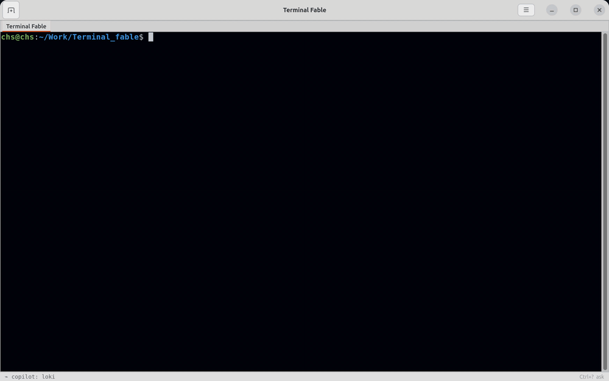

# Terminal Fable



*Split a pane, browse with `sls`, run the tests — then type half a command,
press `Ctrl+?`, and ask. The copilot carries your draft in as context, answers
with a risk badge, and `Take` puts the command on the prompt without running
it.* ([WebP version](docs/demo/demo.webp) · recorded by
[`bin/record-demo`](tools/demo/record_demo.py))

A native Linux terminal with cmux-style split panes, built on GTK 4 and
VTE. One window holds tabs; each tab holds an n-ary split tree of panes.
Panes can be interactive terminals, rendered Markdown viewers, or native
image viewers, and everything is drivable from the keyboard.

This repository implements
[`native-terminal-reproducible-development-plan.md`](native-terminal-reproducible-development-plan.md).
The user-facing guide lives in [`docs/native-terminal-mvp.md`](docs/native-terminal-mvp.md).

## Documentation

Full documentation lives in [`docs/`](docs/README.md):

- [Usage guide](docs/native-terminal-mvp.md) — running it, shortcuts, troubleshooting.
- [Smart ls](docs/smart-ls.md) — the `sls` full-screen directory browser with
  ls-style keys, smart name truncation, and cd-on-exit.
- [Architecture](docs/architecture.md) — design, the pure-core / GTK-shell boundary, the layout engine.
- [Developer guide](docs/developer-guide.md) — setup, tests, conventions, commit/release workflow.
- [Extending](docs/extending.md) — recipes for adding actions, pane types, palettes, config, and layout ops.
- [Decisions](docs/decisions/README.md) — ADRs explaining the major design choices.
- [Copilot development plan](copilot-development-plan.md) — phased roadmap for the
  context-aware terminal copilot specified in
  [`AI_Integration_design.md`](AI_Integration_design.md).

## Requirements

- Linux with a graphical session (X11 or Wayland)
- Python 3 with the system GTK 4 / VTE introspection bindings:

```bash
sudo apt install python3-gi gir1.2-gtk-4.0 gir1.2-vte-3.91 gir1.2-adw-1
```

## Run

```bash
bin/agent-terminal-native
bin/agent-terminal-native --command "bash -lc 'echo ready; exec bash'"
bin/agent-terminal-native --markdown README.md
bin/agent-terminal-native --image path/to/image.png
bin/sls                    # full-screen directory browser (any terminal)
```

The launcher uses system `python3` by default so the system PyGObject
bindings are visible. Set `AGENT_TERMINAL_NATIVE_USE_UV=1` to debug
under `uv` instead.

### Options

| Flag | Effect |
| ---- | ------ |
| `--working-directory DIR` | Starting directory for new terminals |
| `--command CMD` | Run a command instead of the default shell |
| `--title TITLE` | Fixed window title |
| `--hold-on-exit` | Keep the pane open after the child exits |
| `--font-family NAME`, `--font-size PT` | Terminal font |
| `--scrollback-lines N` | Scrollback depth (default 10000) |
| `--cursor-style block\|ibeam\|underline`, `--no-cursor-blink` | Cursor |
| `--palette agent-dark\|agent-light\|solarized-dark` | Color preset |
| `--markdown PATH`, `--image PATH` | Open viewer tabs at startup |
| `--version` | Print the native MVP version |

User config lives at `~/.config/agent-terminal/native.json`:

```json
{
  "pane_close_policy": "adjacent_expand",
  "palette": "agent-dark"
}
```

`pane_close_policy` may be `adjacent_expand` (the closed pane's space
goes to its adjacent sibling) or `same_axis_reflow` (the space is
redistributed proportionally across the remaining siblings).

## Key shortcuts

Pane management uses `Alt+Shift`, common terminal-window commands use
`Ctrl+Shift`, so ordinary terminal input (including plain `Ctrl+H`,
`Ctrl+C`, `Ctrl+D`) is never stolen.

```text
Ctrl+Shift+T      new tab
Ctrl+Shift+O      open file picker
Ctrl+Shift+W      close pane or tab
Alt+Shift+H/V     split left-right / top-bottom
Alt+Shift+Arrows  focus panes
Alt+Shift+F       temporary focus fit
Alt+Shift+Space   pane control mode
Ctrl+Shift+C/V    copy / paste
Ctrl+Shift+F      find
Ctrl+Shift+Space  command menu (copilot)
Ctrl+?            ask mode — chat at the prompt (copilot)
Ctrl+Shift+M      expand copilot model chain in the status bar
Ctrl+Shift+S      session history (copilot)
Alt+Shift+A       pause/resume copilot (active pane)
F5                reload viewer
F / 1             image fit / actual size
Esc               viewer → input back to terminal
Ctrl+Shift+H, F1  shortcut guide
```

The full table is in `docs/native-terminal-mvp.md` and in the in-app
shortcut guide.

## Install a user-local launcher

```bash
packaging/install.sh
```

This installs `~/.local/bin/agent-terminal-native` and a desktop entry.

To bind it to **Ctrl+Alt+T** as the default terminal and recover when a
broken edit breaks the shortcut, see
[`docs/default-terminal-setup.md`](docs/default-terminal-setup.md).

## Development

Unit tests run headlessly (no GUI session or PyGObject needed):

```bash
python3 -m unittest tests.test_native_terminal tests.test_tui_navigation
python3 -m unittest          # full suite
```

Dependency smoke test on a desktop machine:

```bash
python3 -c "import gi; gi.require_version('Gtk','4.0'); gi.require_version('Vte','3.91'); from gi.repository import Gtk, Vte; print('GTK/VTE ok')"
```

### Layout

- `agent_terminal/native_terminal.py` — app entry point, CLI parser,
  pure split-layout engine, Markdown/image helpers, actions and
  shortcuts, control socket, and all GTK/VTE widget classes.
- `agent_terminal/tui_core.py` — shared pure core for the curses tools:
  entry model, directory scanning, control-socket client.
- `agent_terminal/tui_navigation.py` — curses file picker that hands the
  selection back over a Unix control socket.
- `agent_terminal/smart_ls.py` — `sls`, the full-screen directory
  browser ([docs/smart-ls.md](docs/smart-ls.md)).
- `bin/agent-terminal-native`, `bin/sls` — launchers.
- `tests/` — headless behavioral contracts and source guardrails.
- `docs/native-terminal-mvp.md` — usage guide and comparison checklist.
- `packaging/` — user-local install script and desktop entry.
